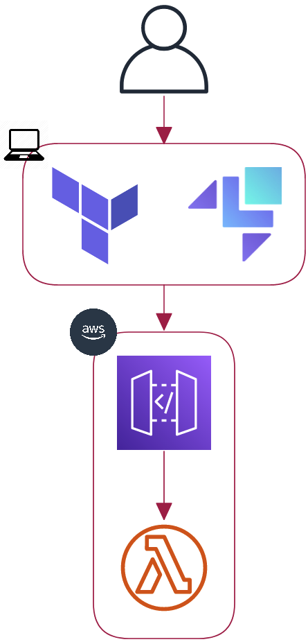

<!--
_class: invert
-->

# **LocalStack 2.0**

1. **Introduction**
2. **Demo with Terraform**
3. **Is it worth it?**
4. **LocalStack PRO**

---

# **Introduction**

- What is [LocalStack](https://localstack.cloud/)?
- What is it for?
  - Accelerate Dev and Test loop
  - Improve quality through simplified testing
  - Save time and resources
- Good [integrations](https://docs.localstack.cloud/user-guide/integrations/) 👏

---

# **Terraform**

Let's get our hands dirty 💪!

- Api gateaway + Lambda
- Deployment time:
  - ~30s AWS
  - ~60s LocalStack
- Let's change Lambda runtime?

---

# **Is it worth it?**

_⚠️OPINIONS MY OWN⚠️_

- Be **careful** with providers
- LocalStack **[almost](https://docs.localstack.cloud/user-guide/aws/feature-coverage/)** emulates AWS
- Community edition does **not** cover all services
- **[Inconvenience](https://docs.localstack.cloud/user-guide/aws/feature-coverage/)** of another layer to maintain
- :negative_squared_cross_mark: Accelerate Dev and Test loop
- :negative_squared_cross_mark: Improve quality through simplified testing
- :negative_squared_cross_mark:~👌 Save time and resources (**serverful**)

---

# **LocalStack PRO**

- Covers [most of](https://docs.localstack.cloud/user-guide/aws/feature-coverage/) AWS services
- `35$` per developer monthly
- IAM security included ¿🤔?

